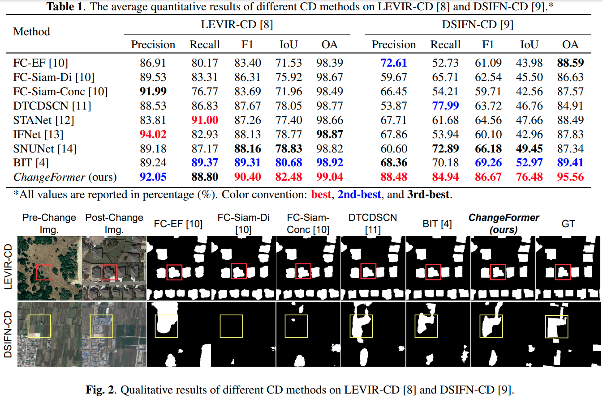

[](https://paperswithcode.com/sota/change-detection-on-dsifn-cd?p=a-transformer-based-siamese-network-for)
[](https://paperswithcode.com/sota/change-detection-on-levir-cd?p=a-transformer-based-siamese-network-for)
# ChangeFormer: A Transformer-Based Siamese Network for Change Detection 
(Under review at IGARSS-2022)

[Wele Gedara Chaminda Bandara](https://www.wgcban.com/), and [Vishal M. Patel](https://engineering.jhu.edu/vpatel36/sciencex_teams/vishalpatel/)


Here, we provide the pytorch implementation of the paper: A Transformer-Based Siamese Network for Change Detection.

For more information, please see our paper at [arxiv](https://arxiv.org/pdf/2201.01293.pdf). 

## Network Architecture


## Quantitative & Qualitative Results on LEVIR-CD and DSIFN-CD


## Requirements

```
Python 3.8.0
pytorch 1.10.1
torchvision 0.11.2
einops  0.3.2
```

Please see `requirements.txt` for all the other requirements.

## Installation

Clone this repo:

```shell
git clone https://github.com/wgcban/ChangeFormer.git
cd ChangeFormer
```

## Quick Start on LEVIR dataset

We have some samples from the [LEVIR-CD](https://justchenhao.github.io/LEVIR/) dataset in the folder `samples_LEVIR` for a quick start.

Firstly, you can download our ChangeFormerV6 pretrained model——by [DropBox](https://www.dropbox.com/sh/xoswrsu9n4ypr5h/AAAmUOE-DTq59fX-tE2TwPzKa?dl=0) or [Github](https://github.com/wgcban/ChangeFormer/releases/download/v0.1.0/CD_ChangeFormerV6_LEVIR_b16_lr0.0001_adamw_train_test_200_linear_ce_multi_train_True_multi_infer_False_shuffle_AB_False_embed_dim_256.zip). After downloaded the pretrained model, you can put it in `checkpoints/ChangeFormer_LEVIR/`.

Then, run a demo to get started as follows:

```python
python demo_LEVIR.py
```

After that, you can find the prediction results in `samples/predict_LEVIR`.


## Quick Start on DSFIN dataset

We have some samples from the [DSIFN-CD](https://github.com/GeoZcx/A-deeply-supervised-image-fusion-network-for-change-detection-in-remote-sensing-images/tree/master/dataset) dataset in the folder `samples_DSFIN` for a quick start.

Firstly, you can download our ChangeFormerV6 pretrained model——by [DropBox](https://www.dropbox.com/sh/yrdbmkvhbpxuabw/AADHQIAd12tFTvBbgbh_z_BGa?dl=0) or [Github](https://github.com/wgcban/ChangeFormer/releases/download/v0.1.0/CD_ChangeFormerV6_DSIFN_b16_lr0.00006_adamw_train_test_200_linear_ce_multi_train_True_multi_infer_False_shuffle_AB_False_embed_dim_256.zip). After downloaded the pretrained model, you can put it in `checkpoints/ChangeFormer_DSIFN/`.

Then, run a demo to get started as follows:

```python
python demo_DSIFN.py
```

After that, you can find the prediction results in `samples/predict_DSIFN`.


## Train on LEVIR-CD

You can find the training script `run_ChangeFormer_LEVIR.sh` in the folder `scripts`. You can run the script file by `sh scripts/run_ChangeFormer_LEVIR.sh` in the command environment.

The detailed script file `run_ChangeFormer_LEVIR.sh` is as follows:

```cmd
#!/usr/bin/env bash

#GPUs
gpus=0

#Set paths
checkpoint_root=/media/lidan/ssd2/ChangeFormer/checkpoints
vis_root=/media/lidan/ssd2/ChangeFormer/vis
data_name=LEVIR


img_size=256    
batch_size=16   
lr=0.0001         
max_epochs=200
embed_dim=256

net_G=ChangeFormerV6        #ChangeFormerV6 is the finalized verion

lr_policy=linear
optimizer=adamw                 #Choices: sgd (set lr to 0.01), adam, adamw
loss=ce                         #Choices: ce, fl (Focal Loss), miou
multi_scale_train=True
multi_scale_infer=False
shuffle_AB=False

#Initializing from pretrained weights
pretrain=/media/lidan/ssd2/ChangeFormer/pretrained_segformer/segformer.b2.512x512.ade.160k.pth

#Train and Validation splits
split=train         #train
split_val=test      #test, val
project_name=CD_${net_G}_${data_name}_b${batch_size}_lr${lr}_${optimizer}_${split}_${split_val}_${max_epochs}_${lr_policy}_${loss}_multi_train_${multi_scale_train}_multi_infer_${multi_scale_infer}_shuffle_AB_${shuffle_AB}_embed_dim_${embed_dim}

CUDA_VISIBLE_DEVICES=1 python main_cd.py --img_size ${img_size} --loss ${loss} --checkpoint_root ${checkpoint_root} --vis_root ${vis_root} --lr_policy ${lr_policy} --optimizer ${optimizer} --pretrain ${pretrain} --split ${split} --split_val ${split_val} --net_G ${net_G} --multi_scale_train ${multi_scale_train} --multi_scale_infer ${multi_scale_infer} --gpu_ids ${gpus} --max_epochs ${max_epochs} --project_name ${project_name} --batch_size ${batch_size} --shuffle_AB ${shuffle_AB} --data_name ${data_name}  --lr ${lr} --embed_dim ${embed_dim}
```

## Train on DSIFN-CD

Follow the similar procedure mentioned for LEVIR-CD. Use `run_ChangeFormer_DSFIN.sh` in `scripts` folder to train on DSIFN-CD.

## Evaluate on LEVIR

You can find the evaluation script `eval_ChangeFormer_LEVIR.sh` in the folder `scripts`. You can run the script file by `sh scripts/eval_ChangeFormer_LEVIR.sh` in the command environment.

The detailed script file `eval_ChangeFormer_LEVIR.sh` is as follows:

```cmd
#!/usr/bin/env bash

gpus=0

data_name=LEVIR
net_G=ChangeFormerV6 #This is the best version
split=test
vis_root=/media/lidan/ssd2/ChangeFormer/vis
project_name=CD_ChangeFormerV6_LEVIR_b16_lr0.0001_adamw_train_test_200_linear_ce_multi_train_True_multi_infer_False_shuffle_AB_False_embed_dim_256
checkpoints_root=/media/lidan/ssd2/ChangeFormer/checkpoints
checkpoint_name=best_ckpt.pt
img_size=256
embed_dim=256 #Make sure to change the embedding dim (best and default = 256)

CUDA_VISIBLE_DEVICES=0 python eval_cd.py --split ${split} --net_G ${net_G} --embed_dim ${embed_dim} --img_size ${img_size} --vis_root ${vis_root} --checkpoints_root ${checkpoints_root} --checkpoint_name ${checkpoint_name} --gpu_ids ${gpus} --project_name ${project_name} --data_name ${data_name}
```

## Evaluate on DSFIN

Follow the same evaluation procedure mentioned for LEVIR-CD. You can find the evaluation script `eval_ChangeFormer_DSFIN.sh` in the folder `scripts`. You can run the script file by `sh scripts/eval_ChangeFormer_DSFIN.sh` in the command environment.

## Dataset Preparation

### Data structure

```
"""
Change detection data set with pixel-level binary labels；
├─A
├─B
├─label
└─list
"""
```

`A`: images of t1 phase;

`B`:images of t2 phase;

`label`: label maps;

`list`: contains `train.txt, val.txt and test.txt`, each file records the image names (XXX.png) in the change detection dataset.

### Data Download 

LEVIR-CD: https://justchenhao.github.io/LEVIR/

WHU-CD: https://study.rsgis.whu.edu.cn/pages/download/building_dataset.html

DSIFN-CD: https://github.com/GeoZcx/A-deeply-supervised-image-fusion-network-for-change-detection-in-remote-sensing-images/tree/master/dataset

## License

Code is released for non-commercial and research purposes **only**. For commercial purposes, please contact the authors.

## Citation

If you use this code for your research, please cite our paper:

```
@misc{bandara2022transformerbased,
      title={A Transformer-Based Siamese Network for Change Detection}, 
      author={Wele Gedara Chaminda Bandara and Vishal M. Patel},
      year={2022},
      eprint={2201.01293},
      archivePrefix={arXiv},
      primaryClass={cs.CV}
}
```

## References
Appreciate the work from the following repositories:

- https://github.com/justchenhao/BIT_CD (Our ChangeFormer is implemented on the code provided in this repository)

